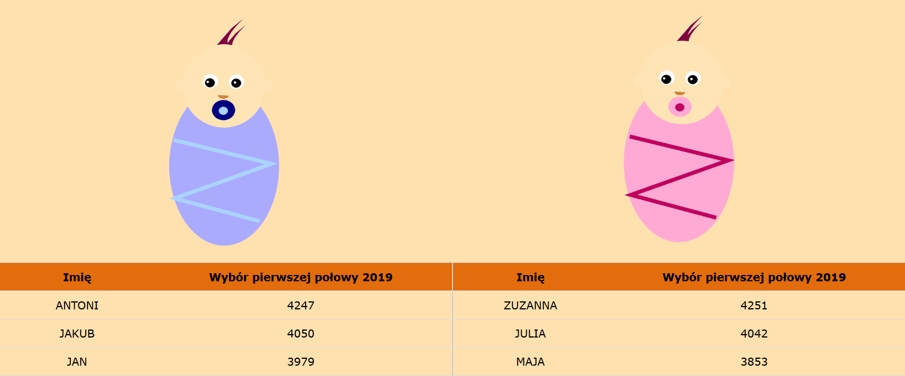
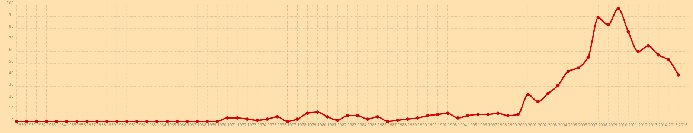

# Javafaktura s02e03 - Spring MVC - REST in peace


# How to read this repository?

This branch contains all implemented features. 

Feel free to: 
- clone this repository :smiley:
- fork this repository :alien:
- break things :sweat_smile:
- implement new features :sunglasses:
- **provide pull request to repository** :heart_eyes:

## Let's choose baby name

```
Once Java Programmer was expecting to have baby, actually 2 babies.
He wrote a program to choose names for his newborns.
Unexpectedly triplets were born and the got the names:
Adam, Frank and... ArrayIndexOutOfBoundsException
```

This is simple program (or rather group of programs) is solving similar problem.
We are going to draw name for a newborn. Data source is based on real data [https://dane.gov.pl/dataset/219,imiona-nadawane-dzieciom-w-polsce](https://dane.gov.pl/dataset/219,imiona-nadawane-dzieciom-w-polsce)

We also present full statistics of most popular names given during first half of 2019.

And plot a graph for names based on historical data.



### Code

#### Core

**Code: [child-core](child-core)**

This module contains *no Spring dependencies*. Just pure Java + library to read csv files.

> What is best approach to test Spring projects?

> Test them like there was no Spring at all. 
> **Marcin Grzejszczak - Principal Software Engineer at Pivotal**

---

#### Spring MVC 

**Code: [child-webapp](child-webapp)**

1. Draw a random name :white_check_mark:
2. Present all names split by gender :white_check_mark:
3. Draw a random name, taking parents preferences to gender and popularity :white_check_mark:
4. Allow to choose name from existing data - should increase occurrence counter :white_check_mark:
5. Allow to choose new name - should add new name with counter=1 :white_check_mark:
6. Show details of certain name using path variable :white_check_mark:

---

#### Spring REST API

**Module: [child-api](child-api)**

1. Serve all name stats :white_check_mark:
2. Serve random name stats :white_check_mark:
3. Serve certain name stats :white_check_mark:
4. Serve history of given name :white_check_mark:
5. Allow to insert existing name - should increase counter :white_check_mark:
6. Allow to insert new name - should add new name with counter=1 :white_check_mark:

---

#### Spring REST API Client

**Module: [child-client](child-client)**

1. Consume all name stats :white_check_mark:
2. Consume random name stats :white_check_mark:
3. Consume certain name stats :white_check_mark:
4. Consume history of given name and plot a graph :white_check_mark:
5. Allow to insert existing name using API - should increase counter :white_check_mark:
6. Allow to insert new name using API - should add new name with counter=1 :white_check_mark:

---